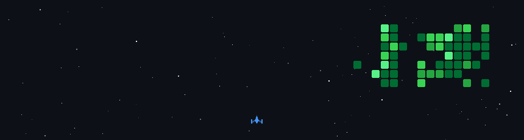

## 🎮 My GitHub Activity Game

---

## 🚀 About Me

**Graduate Engineer in Automation and Robotics** specializing in **AI-driven systems**, **generative AI**, and **autonomous robotics**. Completing my Master's at **Technical University Dortmund**, I combine cutting-edge AI technologies with real-world robotic applications to build intelligent, scalable solutions.

🎯 **Current Focus**
- 👁️ Computer vision and perception systems for autonomous robotics
- 🤖 Generative AI solutions and intelligent automation tools
- 🧠 Multi-agent AI systems for robotic automation
- 📡 LLM fine-tuning, RAG architectures, and knowledge graph solutions

---

## 🌟 Featured Projects

### 🧠 Collaborative Perception GNN - 6G-Enabled Warehouse Intelligence
**Master's Thesis Project | TU Dortmund**

Advanced collaborative perception framework leveraging Graph Neural Networks and mmWave radar technology for intelligent warehouse automation.

**Tech Stack:**

**Key Achievements:**
- Developed 6G-enabled collaborative perception framework using mmWave radar technology
- Implemented Graph Neural Networks for warehouse environment prediction
- Conducted validation with dual robotic platforms and motion capture systems
- Advanced state-of-the-art in multi-robot perception and coordination

**Status:** 🔬 In Progress (Jan 2025 - Jul 2025)

---

### 👁️ RoboVision-3D - Real-Time 3D Object Detection
**Computer Vision for Robotics**

Comprehensive 3D object detection system for autonomous robots, combining point cloud processing with real-time perception capabilities.

**Tech Stack:**

**Key Achievements:**
- Built modular pipeline for object detection, point cloud processing, and map alignment
- Implemented real-time 3D object detection with optimized inference
- Integrated LiDAR and camera sensor fusion for robust perception
- Deployed on embedded systems for edge robotics applications

[📂 View Repository](https://github.com/thiyanayugi)

---

### 🤖 Multi-Modal AI Framework
**Advanced AI System for Multi-Modal Processing**

Comprehensive AI framework integrating vision, text, and sensor data for complex decision-making tasks in robotics and automation.

**Tech Stack:**

**Key Achievements:**
- Designed multi-modal fusion architecture for vision, language, and sensor data
- Implemented attention mechanisms for cross-modal information integration
- Integrated state-of-the-art foundation models (CLIP, LLaVA, GPT-4V)
- Achieved robust performance on complex reasoning tasks

[📂 View Repository](https://github.com/thiyanayugi)

---

### 🦜 Crew AI Multi-Agent System
**LLM-Powered Collaborative Intelligence**

Intelligent multi-agent automation system powered by large language models, enabling autonomous task decomposition and collaborative problem-solving.

**Tech Stack:**

**Key Achievements:**
- Built multi-agent system with role-based task distribution
- Integrated Claude API for advanced reasoning and code generation
- Implemented dynamic workflow orchestration and error recovery
- Deployed automated content creation and research pipelines

[📂 View Repository](https://github.com/thiyanayugi)

---

## 🛠️ Technical Arsenal

### **AI & Machine Learning**

**Specializations:**
- 🧠 Deep Learning, Computer Vision, NLP, Reinforcement Learning
- 🤖 LLM Fine-tuning, Prompt Engineering, RAG Architectures
- 📊 Knowledge Graphs, Vector Databases, Semantic Search

**LLM & GenAI Tools:**

---

### **Robotics & Automation**

**Platforms & Tools:**
- 🤖 ROS/ROS2, Gazebo, MoveIt, Nav2
- 📡 Sensor Fusion: LiDAR, IMU, Camera, mmWave Radar
- 🗺️ SLAM, Path Planning, Motion Control
- 🏭 Industrial Automation, Fleet Management

---

### **Cloud & MLOps**

**Expertise:**
- ☁️ AWS SageMaker, Lambda, EC2, Model Deployment
- 🐳 Docker, Kubernetes, CI/CD Pipelines
- 📈 MLOps, Model Monitoring, Scalable Deployments

---

### **Development Tools**

---

## 💼 Professional Experience

<b>🔬 Research Assistant | TU Dortmund</b> <i>(Jun 2024 - May 2025)</i>

**Information Processing Laboratory**

- Designed deep learning models for intelligent signal interpretation in electromagnetic systems
- Applied reinforcement learning for adaptive optimization in dynamic environments
- Improved signal processing precision using supervised ML techniques
- Published research findings in IEEE conferences

<b>📚 Master's Thesis | TU Dortmund</b> <i>(Jan 2025 - Jul 2025)</i>

**Chair of Material Handling and Warehousing**

- Developed 6G-enabled collaborative perception framework using mmWave radar technology
- Implemented Graph Neural Networks for warehouse environment prediction
- Conducted validation with dual robotic platforms and motion capture systems
- Advanced state-of-the-art in multi-robot collaborative perception

<b>🤖 Robotics Engineering Intern | Pricol Limited</b> <i>(Nov 2021 - Jun 2022)</i>

**Autonomous Systems**

- Designed and deployed Autonomous Mobile Robot for industrial logistics
- Integrated LiDAR, IMU, and camera systems for SLAM-based navigation
- Developed real-time path planning and obstacle avoidance algorithms
- Reduced material handling time by 40% through autonomous fleet deployment

---

## 🎓 Education

### 🎓 Master of Science in Automation and Robotics
**Technical University Dortmund** | _October 2022 - July 2026_

- Specialization: AI-driven systems, autonomous robotics, sensor fusion
- Research: 6G-enabled collaborative perception, Graph Neural Networks
- Thesis: Collaborative Perception for Warehouse Automation using GNNs

### 🎓 Bachelor of Engineering in Robotics and Automation
**PSG College of Technology** | _July 2018 - May 2022_

- Focus: Industrial automation, mobile robotics, control systems
- Capstone: Autonomous Mobile Robot for industrial logistics

---

## 📊 GitHub Analytics

---

## 🎯 Currently Open to Opportunities

I'm actively seeking **full-time positions in Germany** 🇩🇪 in:

- 🤖 **AI/ML Engineering** - LLM applications, computer vision, GenAI
- 🦾 **Robotics Engineering** - Autonomous systems, perception, SLAM
- 🏭 **Automation Engineering** - Industrial AI, smart manufacturing
- 🔬 **Research Positions** - AI for robotics, collaborative perception

**What I Bring:**
- Strong foundation in AI, robotics, and automation
- Proven track record with real-world projects and research
- Hands-on experience with modern LLMs (GPT-4, Claude, Gemini)
- Expertise in ROS/ROS2 and embedded robotics systems
- Passion for building intelligent, scalable solutions

---

## 🌐 Languages

- 🇬🇧 **English** - C2 (Proficient)
- 🇩🇪 **German** - B2 (In Progress)

---

## 📫 Let's Connect!

I'm always interested in collaborating on innovative AI and robotics projects. If you're working on something exciting or have opportunities that align with my expertise, let's talk!

---

### 💡 *"Building intelligent systems that bridge the gap between AI and the physical world"*

---

### ⭐ If you find my work interesting, feel free to star my repositories!

