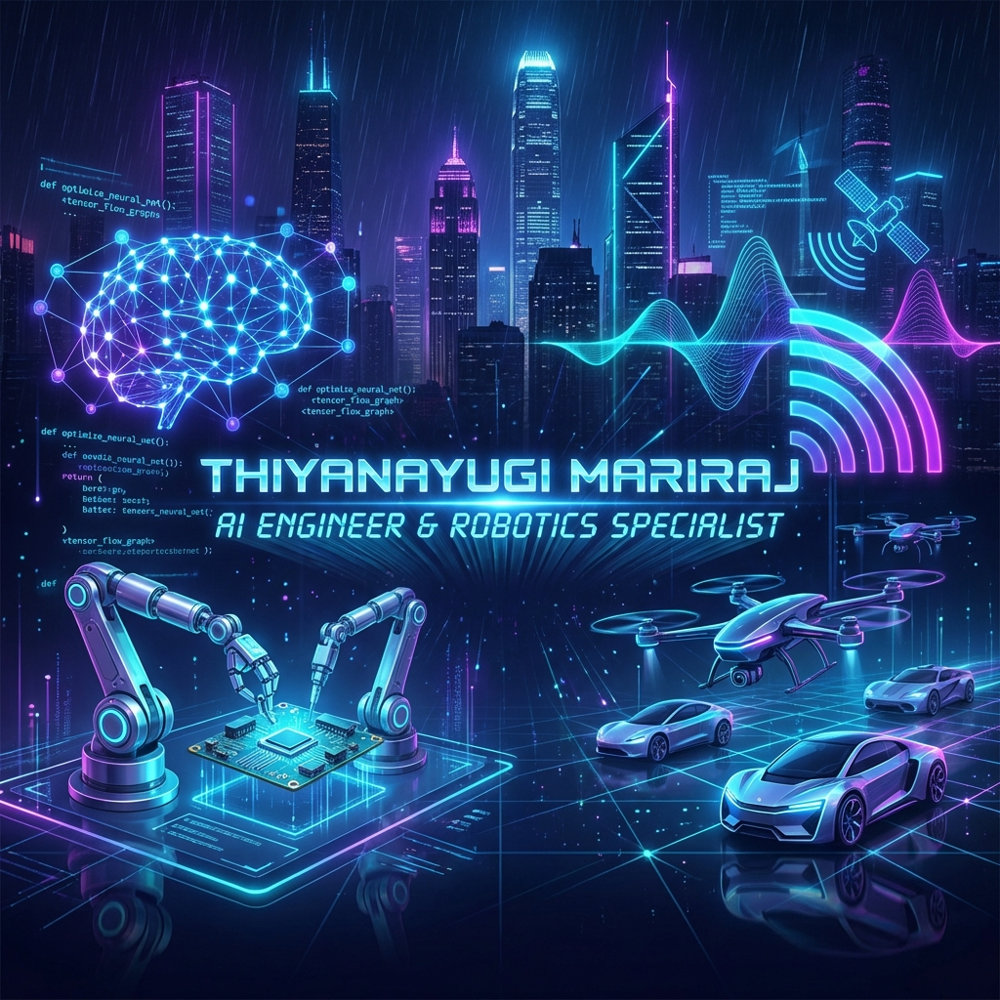

## 🎮 My GitHub Activity Game

---

## 🚀 About Me

> **Identity_Matrix**

**AI Engineer & Robotics Specialist** architecting the synapse between digital intelligence and physical action.

As a **Graduate Researcher in Automation & Robotics** at **TU Dortmund**, I don't just write code; I architect **embodied agents** that perceive, reason, and interact with the real world. My work fuses **Generative AI** with robust **Robotic Control**, transforming static models into dynamic systems. From orchestrating **Multi-Agent swarms** to deploying **6G-enabled perception**, I focus on the hard edge of innovation where AI meets Physics.

🎯 **Current Focus**
- 🦾 **Autonomous Robotics**: Integrating advanced perception and control systems.
- 🧠 **Generative AI**: Building intelligent agents and content creation pipelines.
- 👁️ **Computer Vision**: Real-time 3D object detection and semantic understanding.
- 📡 **6G Collaborative Perception**: Next-gen communication for multi-robot systems.

---

## 🛠️ Technical Arsenal

### **💻 Programming Languages**

### **🧠 AI & Machine Learning**

### **✨ Generative AI & LLMs**

### **🤖 Robotics & Automation**

### **☁️ Cloud & DevOps**

---

## 💼 Execution Logs (Experience)

<b>🔬 Research Assistant | TU Dortmund</b> <i>(Jun 2024 – May 2025)</i>

**Information Processing Laboratory**
- Designed deep learning models for intelligent signal interpretation in complex electromagnetic systems.
- Applied reinforcement learning for adaptive optimization and real-time parameter tuning in dynamic environments.
- Improved signal processing precision in high-frequency industrial applications via supervised ML techniques.

**Stack:** Python, PyTorch, TensorFlow, RL

<b>📚 Master's Thesis | FLW (TU Dortmund)</b> <i>(Jan 2025 – Jul 2025)</i>

**Collaborative Robotic Perception**
- Developed 6G-enabled collaborative perception for multi-robot systems using mmWave radar technology.
- Implemented Graph Neural Networks architectures for real-time occupancy prediction in warehouse environments.
- Conducted comprehensive validation using dual robotic platforms with motion capture ground truth systems.

**Stack:** Python, GNN, mmWave Radar, ROS

<b>🤖 Robotics Engineering Intern | Pricol Limited</b> <i>(Nov 2021 – Jun 2022)</i>

**Autonomous Systems**
- Designed and deployed Autonomous Mobile Robot for industrial logistics and inspection automation applications.
- Integrated LiDAR, IMU, and camera systems for robust SLAM-based navigation in dynamic industrial environments.
- Developed real-time path planning and obstacle avoidance algorithms using ROS framework.

**Stack:** ROS, Python, C++, LiDAR, SLAM

---

## 🌟 Deployed Modules (Featured Projects)

| Project | Description | Tech Stack |
|:---|:---|:---|
| **[AutoGen Content Pipeline](https://github.com/thiyanayugi/AutoGen-Agent-Orchestrated-Content-Framework)** | Enterprise-grade multi-agent AI system designed to automate end-to-end content creation workflows. | Autogen, DeepSeek |
| **[RoboVision-3D](https://github.com/thiyanayugi/RoboVision-3D)** | Computer Vision system for Indoor Robotics with Multi-Sensor Fusion integrating RGB-D cameras and LiDAR. | Python, YOLOv8, ROS |
| **[Context-Aware Chatbot](https://github.com/thiyanayugi/context-aware-chatbot)** | Production-style LLM chatbot with intelligent context window management, long-term memory, and safety guardrails. | Python, LLM, Vector DB |
| **[Autonomous Market Intel](https://github.com/thiyanayugi/Autonomous-Market-Intelligence-System-Using-Multi-Agent-AI-CrewAI-)** | CrewAI-powered multi-agent system with four specialized agents for autonomous market intelligence. | CrewAI, Claude, RAG |
| **[Autolearn AI Platform](https://github.com/thiyanayugi/teaching-website)** | Production Web Platform with Claude API-powered Chatbot and AI-driven personalized email generation system. | JS, Claude API, Cloud Run |
| **[AI-Based PCB Design](https://github.com/thiyanayugi/AI-Based-SI-Compliant-PCB-Design)** | Neural Networks for Predictive Maintenance with real-time signal integrity classification. | TensorFlow, Edge AI |
| **[Edge Detection 3D Vision](https://github.com/thiyanayugi/ros-edge-detection-3d)** | 3D Vision System with Real-Time Image Processing and modular edge detection with ROS. | ROS, OpenCV, RViz |
| **[GraphRAG Knowledge Graph](https://github.com/thiyanayugi/Knowledge-Graph-Enhanced-Retrieval-Augmented-Generation)** | Production-ready RAG system combining knowledge graphs with vector search for multi-hop reasoning. | GraphDB, Vector, Gradio |
| **[AI Document Explainer](https://github.com/thiyanayugi/ai-document-explainer)** | Production-ready AI tool helping international students understand official documents with GPT-4. | Python, GPT-4, Streamlit |
| **[Robotic Automation Platform](https://github.com/thiyanayugi)** | Multi-DOF Robotic Arm with Omnidirectional Base for factory automation with adaptive motion. | ROS, Motion Planning |
| **[Multi-modal AI Framework](https://github.com/thiyanayugi/Multi-Modal-AI-Framework-for-Robotic-Task-Automation)** | Multi-Agent System integrating CLIP vision, GPT-3.5 NLP, and RAG for robotic task planning. | LangChain, CLIP, RAG |
| **[LinkedIn Job Automation](https://github.com/thiyanayugi/linkedin-job-automation)** | Automated LinkedIn job search and application tracking system with intelligent filtering. | Python, Scraping |

---

## 📜 Encrypted Credentials (Certifications)

- 🏅 **Generative AI Learning Plan** - AWS
- 🏅 **AI Agents with HuggingFace** - HuggingFace
- 🏅 **No-Code ML & GenAI on AWS** - AWS
- 🏅 **ChatGPT Prompt Engineering** - DeepLearning.AI

---

## 🔬 Research Output

- 📄 **RFID based Human Following Load Carrier** | *NVEO Journal (2021)*
- 📄 **Development Of Robotic Arm On An Omnidirectional Base** | *NVEO Journal (2021)*

---

## 🎓 Education

- **Master of Science in Automation and Robotics** | TU Dortmund (2022 - 2026)
- **Bachelor of Engineering in Robotics and Automation** | PSG College of Technology (2018 - 2022)

---

## 📊 Neural Statistics

---

## 📡 End Transmission

*"Architecting the synapse between digital intelligence and physical action."*

