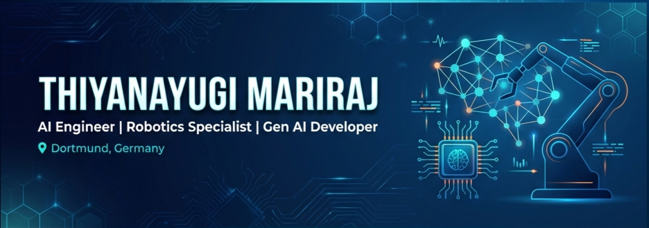
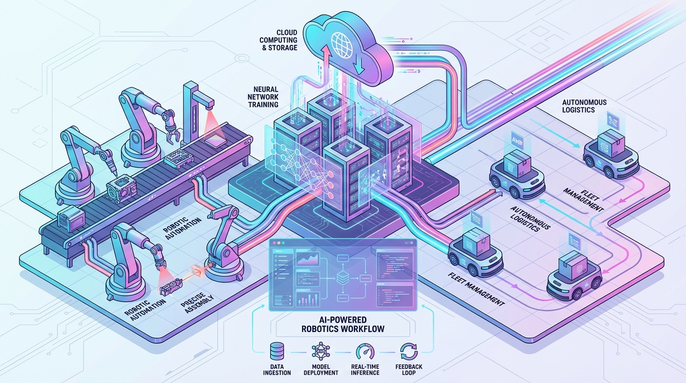
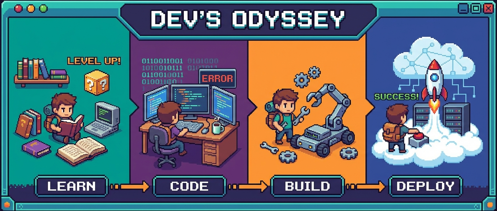

---

## 🚀 About Me

I'm a **Graduate Engineer in Automation and Robotics** specializing in **AI-driven systems**, **generative AI**, and **autonomous robotics**. Completing my Master's at **Technical University Dortmund**, I combine cutting-edge AI technologies with real-world robotic applications to build intelligent, scalable solutions.

🎯 **Current Focus:**

- 👁️ Developing **computer vision and perception systems** for autonomous robotics
- 🤖 Building **generative AI solutions** and intelligent automation tools
- 🧠 Creating **multi-agent AI systems** for robotic automation
- 📡 Implementing **LLM fine-tuning**, **RAG architectures**, and **knowledge graph** solutions

  

---

## 💼 Professional Experience

### 🔬 Research Assistant | TU Dortmund

**Information Processing Laboratory** | _June 2024 - May 2025_

- Designed deep learning models for intelligent signal interpretation in electromagnetic systems
- Applied reinforcement learning for adaptive optimization in dynamic environments
- Improved signal processing precision using supervised ML techniques

### 📚 Master's Thesis | TU Dortmund

**Chair of Material Handling and Warehousing** | _January 2025 - July 2025_

- Developed 6G-enabled collaborative perception framework using mmWave radar technology
- Implemented Graph Neural Networks for warehouse environment prediction
- Conducted validation with dual robotic platforms and motion capture systems

### 🤖 Robotics Engineering Intern | Pricol Limited

**Autonomous Systems** | _November 2021 - June 2022_

- Designed and deployed Autonomous Mobile Robot for industrial logistics
- Integrated LiDAR, IMU, and camera systems for SLAM-based navigation
- Developed real-time path planning and obstacle avoidance algorithms

---

## 🎓 Education

### 🎓 Master of Science in Automation and Robotics

**Technical University Dortmund** | _October 2022 - July 2026_

- Specialization: AI-driven systems, autonomous robotics, sensor fusion
- Research: 6G-enabled collaborative perception, Graph Neural Networks

### 🎓 Bachelor of Engineering in Robotics and Automation

**PSG College of Technology** | _July 2018 - May 2022_

- Focus: Industrial automation, mobile robotics, control systems
- Capstone: Autonomous Mobile Robot for industrial logistics

---

## 🛠️ Technical Arsenal

### **AI & Machine Learning**

**Specializations:**

- 🧠 Deep Learning, Computer Vision, NLP, Reinforcement Learning
- 🤖 LLM Fine-tuning, Prompt Engineering, RAG Architectures
- 📊 Knowledge Graphs, Vector Databases, Semantic Search

### **Robotics & Automation**

**Platforms & Tools:**

- 🤖 ROS, ROS2, Gazebo, SLAM, Path Planning
- 📡 LiDAR, IMU, Camera Systems, mmWave Radar
- 🏭 Industrial Automation, Fleet Management, Quality Control

### **Cloud & MLOps**

**Expertise:**

- ☁️ AWS SageMaker, Model Deployment, Edge AI
- � Docker, Kubernetes, CI/CD Pipelines
- 📈 MLOps, Model Monitoring, Scalable Deployments

---

## 📊 GitHub Stats & Activity

  

---

## 🌐 Languages

- 🇬🇧 **English** - C2 (Proficient)
- 🇩🇪 **German** - B2 (In Progress)

---

## 📫 Let's Connect!

I'm always interested in collaborating on innovative AI and robotics projects, especially in:

- 🤖 Autonomous systems and multi-robot coordination
- 🧠 Generative AI and LLM applications
- 🏭 Industrial automation and smart manufacturing
- 📡 Sensor fusion and computer vision

**Open to opportunities in Germany** 🇩🇪

---

  
### 💡 *"Building intelligent systems that bridge the gap between AI and the physical world"*

---

### ⭐ If you find my work interesting, feel free to star my repositories!

